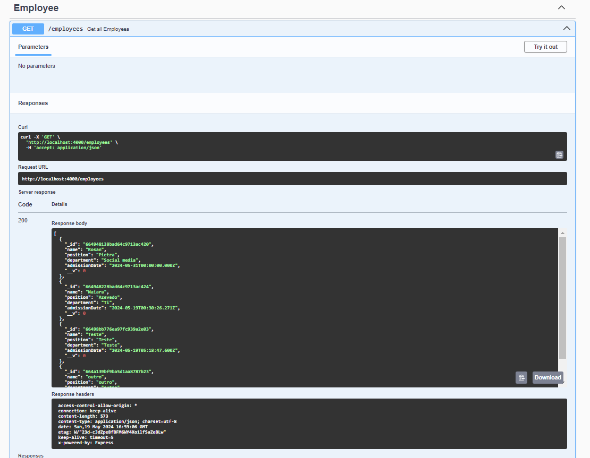

# API de Gerenciamento de Funcionários

Bem-vindo à API de Gerenciamento de Funcionários! Esta API permite criar, listar, atualizar e excluir informações de funcionários.

## Acesso à Documentação da API

Você pode acessar a documentação da API através do Swagger UI. Siga as instruções abaixo para acessar:

1. **Inicie o Servidor**: Certifique-se de que o servidor da API está em execução. Se não estiver, você pode iniciar executando o comando `docker compose -d`.

2. **Acesse o Swagger UI**: Abra seu navegador e vá para o seguinte endereço: http://localhost:4000/docs

3. **Explore a Documentação**: Na interface do Swagger UI, você pode ver todos os endpoints disponíveis, os parâmetros necessários, os modelos de dados e até mesmo testar os endpoints diretamente na interface.

## Exemplos de Uso Manualmente

Aqui estão alguns exemplos de como utilizar os endpoints da API:

### 1. Listar Todos os Funcionários

- **Endpoint**: GET /employees
- **Descrição**: Retorna uma lista de todos os funcionários cadastrados.
- **Exemplo de Requisição**:

